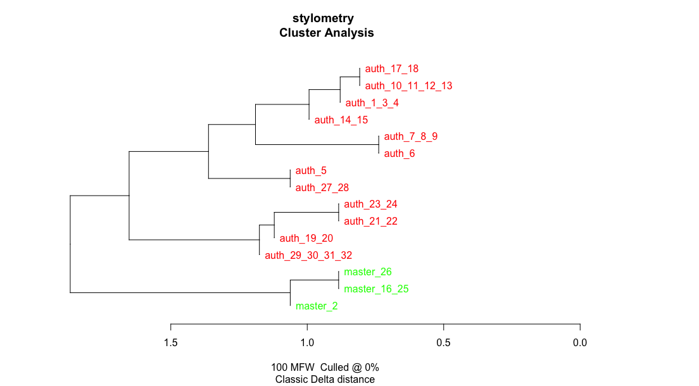

# Сравнение стиля библейских глав «Мастера и Маргариты» с остальными главами романа

В данной работе была поставлена задача выяснить, отличается ли стиль глав, авторство которых принадлежит герою Булгакова – мастеру – от стиля глав с другим повествователем.
Для того, чтобы применить инструмент stylo, некоторые подряд идущие главы, относившиеся к одной категории, были объединены в один текст, так чтобы длина каждого составляла не менее 5 тыс. слов.
Как видно на графике, инструмент stylo выявил различия между двумя стилями: главы мастера выделены зеленым, а остальные главы – красным.

